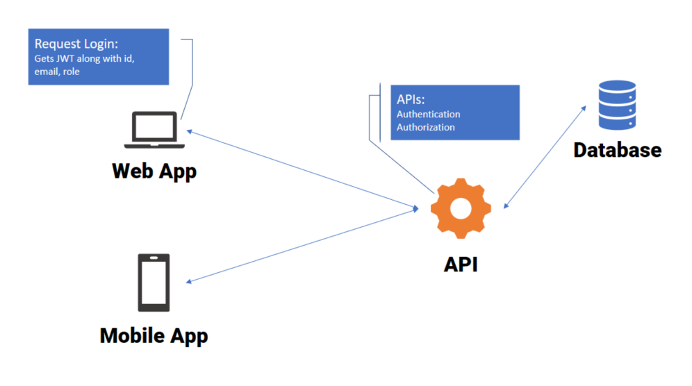
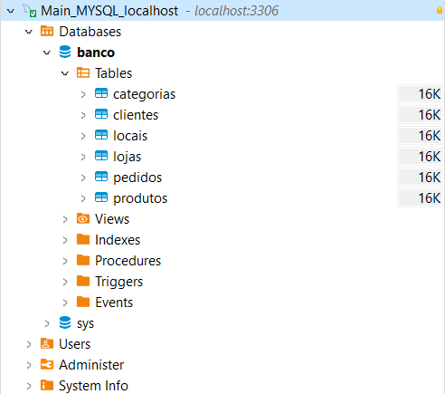
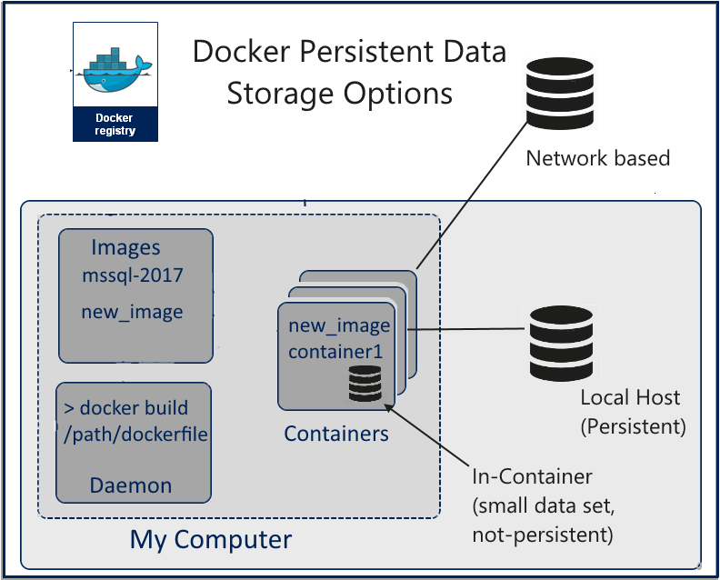
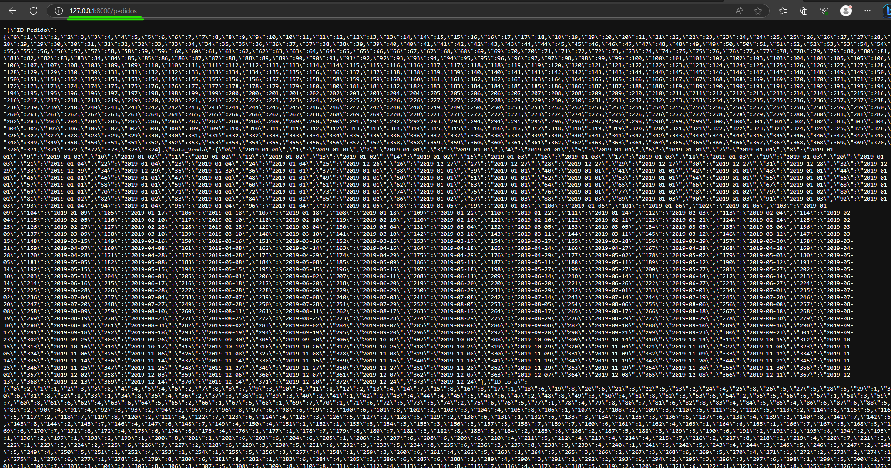
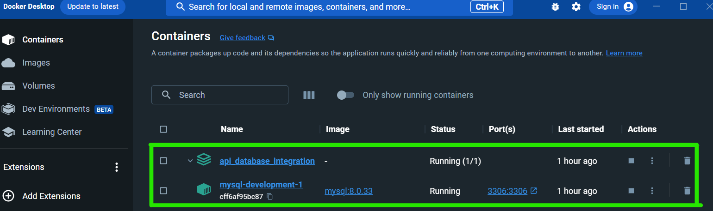
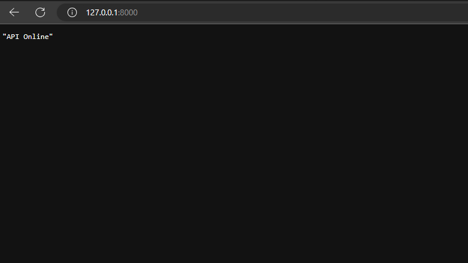
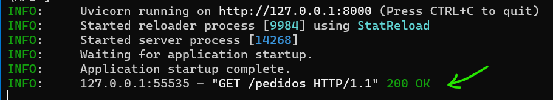
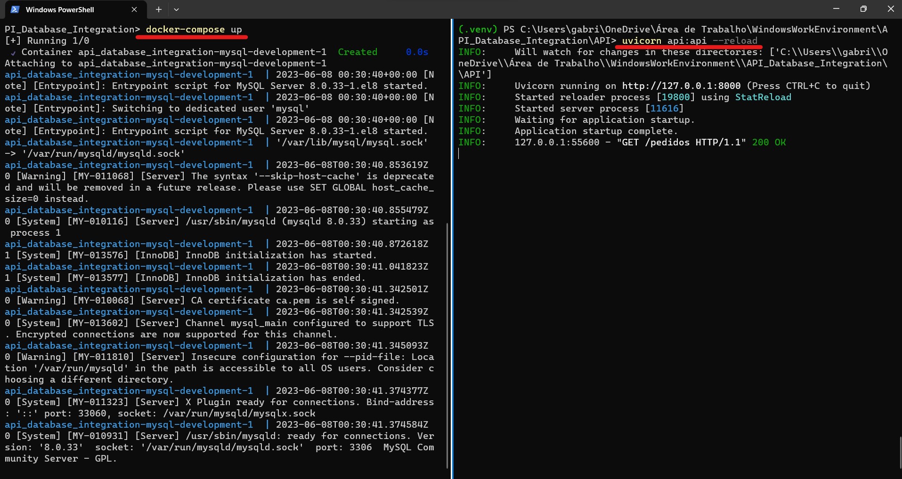

# Integration between API and Database

## What is the relation between a Database and an API?

- Basically, an [API (_Application Programming Interface_)](https://www.ibm.com/topics/api) is a set of defined rules that enable different applications to communicate with each other, like a bridge.
- So, if we have a database and we don't want other devices or subprograms accessing the database directly is implemented an API.
- Using an API we can guarantee security to our database, restrincting all subprograms and requests to a limited quantity of operations based on available endpoints.
- So, with an API we avoid to receive a "DROP DATABASE" comming from any application.

<br><br>



---

## Database

- Database: MySQL 8.0.33 (_localhost_)
- The API communicates with a [MySQL](https://www.mysql.com) database, which is running on a Docker container. This setup ensures portability and ease of deployment. The following tables are available in the database:

1. Pedidos
2. Produtos
3. Categorias
4. Clientes
5. Lojas
6. Locais
<br><br>



---

### Docker + DB Diagram:


---

## Endpoints

The API exposes the following endpoints for accessing and manipulating data:

1. `/pedidos` - Retrieves all orders
2. `/pedidos/{id_pedido}` - Retrieves a specific order by its ID
3. `/produtos` - Retrieves all products
4. `/produtos/{id}` - Retrieves a specific product by its ID
5. `/lojas` - Retrieves all stores
6. `/lojas/{id}` - Retrieves a specific store by its ID
7. `/clientes` - Retrieves all customers
8. `/clientes/{id}` - Retrieves a specific customer by their ID
9. `/locais` - Retrieves all locations
10. `/locais/{UF}` - Retrieves locations by the specified state (e.g., `/locais/SP` for São Paulo)
11. `/categorias` - Retrieves all categories
12. `/categorias/{id}` - Retrieves a specific category by its ID
13. `/relatorio_vendas/produtos` - Retrieves a sales report for products
14. `/relatorio_vendas/lojas` - Retrieves a sales report for stores
15. `/relatorio_vendas/clientes` - Retrieves a sales report for customers



---

## Docker Compose

To run the API project with the MySQL database in a [Docker](https://www.docker.com) container, you can use the following `docker-compose.yml` configuration:

```yaml
version: '3'

services:
  mysql-development:
    image: "mysql:${MYSQL_VERSION}"
    environment:
      MYSQL_HOST: "${MYSQL_HOST}"
      MYSQL_ROOT_PASSWORD: "${MYSQL_ROOT_PASSWORD}"
      MYSQL_DATABASE: "${MYSQL_DATABASE}"
    ports:
      - "3306:3306"
```   



---

## SQL Statements in Code

```Python
@api.get("/relatorio_vendas/produtos")
def get_df_relatorio_vendas_produto():
    query = '''
    SELECT
        pedidos.ID_Produto, 
        pedidos.Qtd_Vendida, 
        pedidos.Preco_Unit, 
        pedidos.Custo_Unit, 
        produtos.Nome_Produto, 
        produtos.Marca_Produto 
    FROM pedidos 
    INNER JOIN produtos 
        ON pedidos.ID_Produto = produtos.ID_Produto;
        '''
    df =  pd.DataFrame(engine.connect().execute(text(query)))
    return df.to_json()
```

---

## Project Running Images

### API Online

---
### API Status

---
### Docker and API

---

---

## *Final Notes*
- Created by: *Gabriel Zuany Duarte Vargas*
- 2023, June
- Fell free to sugest new features!

---
   
